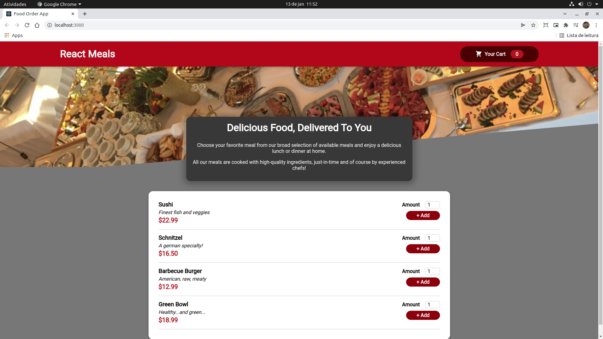

Project realized during the course: "React - The Complete Guide - by Academind / Maximilian Schwarzmüller"

- React Basics
- Portals
- Context API
- Hooks (useRef, useState, useReducer, useEffect, useContext)

PS: Backend refactored from Firebase to Express

